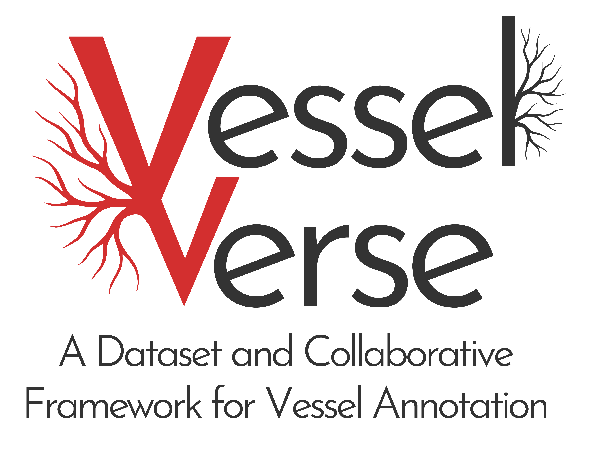
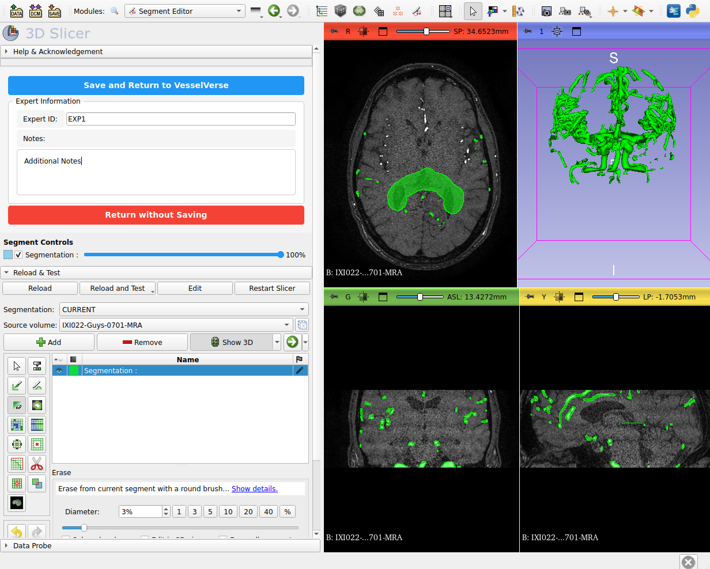
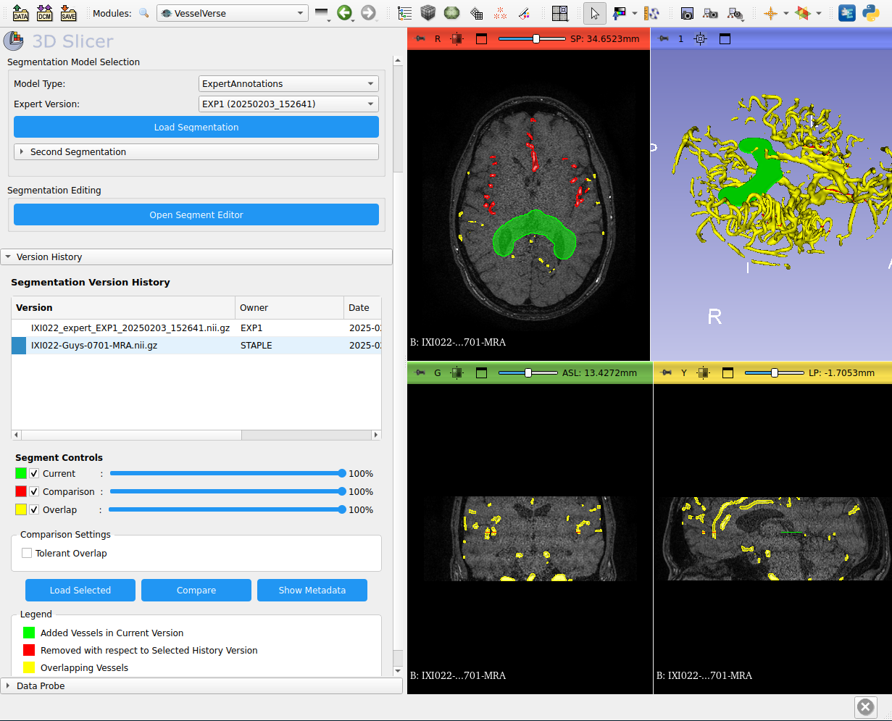

# VesselVerse: A Dataset and Collaborative Framework for Vessel Segmentation
## A Universal Framework for Version-Controlled Medical Image Annotations



A collaborative framework designed to incrementally improve ANY type of medical image annotation, beyond just brain vessels. Features a Git-like Data Version Control System integrated into a custom 3D Slicer extension for interactive visualization, annotation editing, and version comparison, with STAPLE-based consensus generation.


## Table of Contents
1. [Prerequisites](#prerequisites)
2. [Installation](#installation)
3. [Project Structure](#project-structure)
4. [Setup](#setup)
5. [Usage](#usage)
6. [Features](#features)

## Prerequisites

- 3D Slicer (Version 5.2.1 or later)
- Python 3.9+
- Git
- Sufficient disk space (at least 10GB recommended)

## Installation

### 1. Clone the Repository
```bash
git clone https://github.com/your-repo/vesselverse.git
cd vesselverse
```

### 2. Set Up the Data Directory Structure
```bash
mkdir -p data/{IXI_TOT,STAPLE,StochasticAL,nnUNet,A2V,Filtering,ExpertAnnotations,metadata}
```

### 3. Install the Slicer Extension

#### Method A: Using Slicer Extension Manager
1. Open 3D Slicer
2. Go to *Edit* → *Application Settings*
3. Click on *Modules*
4. Add the path to the VesselVerse extension directory:
   ```
   /path/to/vesselverse/src/slicer_extension/VesselVerse
   ```

#### Method B: Manual Installation
1. Copy the VesselVerse extension to Slicer's extension directory:
   ```bash
   cp -r src/slicer_extension/VesselVerse ~/.local/share/3D\ Slicer/Extensions/
   ```
2. Restart Slicer

## Project Structure

```
vesselverse/
└── src/
    └── slicer_extension/
        └── VesselVerse/
            ├── CMakeLists.txt
            ├── __init__.py
            └── VesselVerse.py

vesselverse_IXI/
├── data/
    ├── IXI_TOT/          # Original images
    ├── STAPLE/           # STAPLE consensus segmentations + preprocessing
    ├── STAPLE_base/      # STAPLE consensus segmentations w/o preprocessing
    ├── StochasticAL/     # Model segmentations
    ├── nnUNet/           # Model segmentations
    ├── A2V/              # Model segmentations
    ├── Filtering/        # Model segmentations
    ├── ....               
    ├── model_metadata/   # Generated metadata files
    |
    ├── ExpertAnnotations/# Expert annotations
    └── metadata/         # Generated metadata files (for expert annotations)
```

## Setup

### 1. Data Organization
1. Place your original MRA images in the `data/IXI_TOT/` directory
   - Format: NIFTI (.nii.gz)
   - Naming convention: `IXI[ID]-Guys-[NUM]-MRA.nii.gz`

2. Place model segmentations in their respective directories:
   - STAPLE consensus + Preprocessing (Vessel Enhancement): `data/STAPLE/`
   - STAPLE consensus w/o preprocessing: `data/STAPLE_base/`
   - StochasticAL results: `data/StochasticAL/`
   - nnUNet predictions: `data/nnUNet/`
   - A2V outputs: `data/A2V/`
   - Filtering results: `data/Filtering/`

### 2. Metadata Setup
The metadata directory will be automatically populated as you use the system. Initial structure:
```bash
mkdir -p data/metadata
```

## Usage

### 1. Starting the Application

1. Open 3D Slicer
2. In the module selector, choose *VesselVerse*
3. The VesselVerse interface will appear in the module panel

Optional: 
```bash
bash scripts/launch_slicer.sh 
```
Run this command to have direct access to 3D Slicer with the VesselVerse module

### 2. Loading Data

1. **Select Input Image**
   - Click $\blacktriangledown$ in the *Image Selection* panel 
   - Navigate in the `data/IXI_TOT` directory
   - Select your MRA image file

2. **Choose Model Type**
   - Select from the dropdown:
     - STAPLE
     - STAPLE_base
     - StochasticAL
     - nnUNet
     - A2V
     - Filtering
     - ExpertAnnotations
     - ...

3. **Load Segmentation**
   - Click *Load Segmentation*
   - For expert annotations, select the specific version from the dropdown


### 3. Making Modifications

1. **Open Segment Editor**
   - Click *Open Segment Editor*
   - Use Slicer's segmentation tools to make modifications

2. **Save Changes**
   - Enter your Expert ID
   - Add any relevant notes
   - Click *Save and Return to VesselVerse*
  


### 4. Compare multiple version from history

1. **Load Expert Segmentation**
   - Select ExpertAnnotations from Model Type
   - Select the modified segmentation and load it
2. **Compare with Historical Version**
   - Select version in Version History tree
   - Click *Compare* button
3. **View Comparison**
   - ${\color{green}Green}$: Added vessels in current version
   - ${\color{red}Red}$: Removed vessels w.r.t. selected history version
   - ${\color{yellow}Yellow}$: Overlapping vessels
   
   Use opacity sliders to adjust visibility
   


### 5. Viewing Metadata
The metadata for each modification is stored in JSON format in:
```
data/metadata/[MODEL_TYPE]_expert_metadata.json
```


## Features

### Version Control
- Each modification creates a new version
- Original segmentation paths are tracked
- Complete modification history is maintained

### Metadata Tracking
- Expert identification
- Timestamp information
- File hashing for version control
- Modification notes
- Original segmentation references

### Multiple Model Support
- STAPLE consensus integration
- Support for multiple AI model outputs
- Expert annotation versioning

### Error Recovery

1. If a segmentation fails to load:
   - Close the current scene
   - Restart the module
   - Try loading the image again

2. If metadata fails to update:
   - Check the metadata directory permissions
   - Verify the JSON file structure
   - Try saving again with a different expert ID


### Contact
For questions or contributions, please contact:

Project Lead: 
   - Daniele Falcetta (daniele.falcetta@eurecom.fr - EURECOM, Biot, France)
   - Maria A. Zuluaga (maria.zuluaga@eurecom.fr - EURECOM, Biot, France)

### Project Webpage: 
#### https://i-vesseg.github.io/vesselverse/

### Dataset Repository:
#### Soon available

### Funding: 
#### This work is supported by the ERC CoG CARAVEL and ANR JCJC project I-VESSEG (22-CE45-0015-01).

<table align="center">
  <tr>
      <td>
      
    </td>
    <td>
      
    </td>
        <td>
      
    </td>
  </tr>
</table>